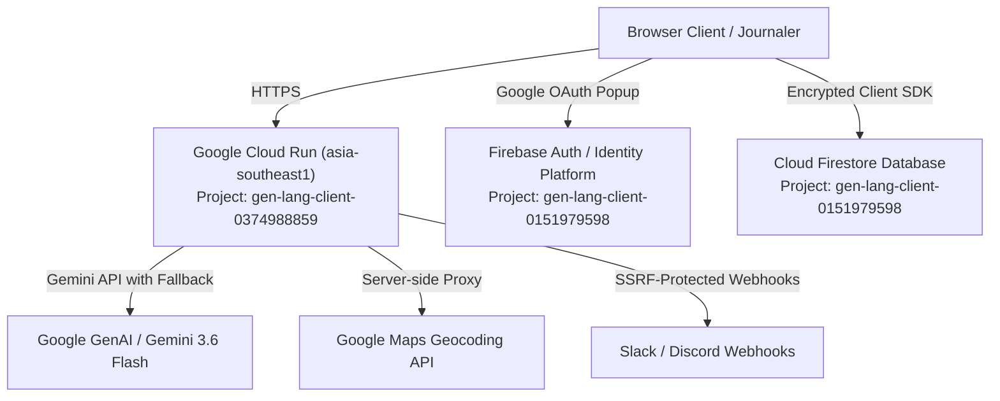

# ReflectAI — User-Authenticated Journal & Gemini Reflection Partner

A full-stack, privacy-first personal journaling platform built with **React**, **Node.js (Express)**, **Google Cloud Firestore**, **Firebase Authentication / Identity Platform**, and the **Gemini 3.6 Flash API**.

[](https://reflectai-journal-ai-reflection-assistant-247017221920.asia-southeast1.run.app)
[](https://github.com/Aayush4396/ReflectionAI)
[](LICENSE)

---

## 🌟 Live Demo & Service Information

* **Live Cloud Run URL**: [https://reflectai-journal-ai-reflection-assistant-247017221920.asia-southeast1.run.app](https://reflectai-journal-ai-reflection-assistant-247017221920.asia-southeast1.run.app)
* **Region**: `asia-southeast1` (Singapore)
* **Active Revision**: `reflectai-journal-ai-reflection-assistant-00010-4f2`
* **Health Check**: [`/api/health`](https://reflectai-journal-ai-reflection-assistant-247017221920.asia-southeast1.run.app/api/health) (`status: healthy`, `hasApiKey: true`)

---

## 💡 Human-Centered Everyday UX

ReflectAI is designed with **warm, accessible, human language** so everyday journalers feel safe, supported, and unburdened by technical cloud or cybersecurity jargon:

- **Journal Sanctuary**: A clean, distraction-free writing environment with auto-save, emotion tagging, and ambient reflection tools.
- **Your Privacy Promise**: Replaces technical threat modeling modals with four clear, plain-English guarantees:
  1. *Your Words Stay Yours* (private user isolation)
  2. *AI Reflections Without Data Storing* (privacy-first Gemini API inference)
  3. *Safe Location Tagging* (strict opt-in memory tagging)
  4. *Protected Connected Apps* (SSRF-shielded Slack and Discord summaries)
  *(An optional collapsible "Technical Details" accordion is available for curious developers).*
- **Choose Conversation Style**: Select from intuitive AI reflection tones:
  - *Thoughtful Questions* (Socratic exploration)
  - *Summary & Takeaways* (Concise recap)
  - *Fresh Perspectives* (Gentle cognitive reframing)
  - *Action Steps* (Practical micro-tasks)
  - *Mindful Support* (Compassionate empathy)
- **Places & Memories (Mindset Atlas)**: Opt-in geographic memory mapping with dual-key proxy protection, coordinate boundary validation, and zero silent tracking.
- **Word Search & Search by Feeling**: Search your history by exact keywords or explore journal entries by abstract emotions, moods, or conceptual ideas.
- **Turn Thoughts into Next Steps**: Automatically surface realistic, step-by-step micro-tasks and add them directly to Google Calendar or export an `.ics` file.
- **Voice Memo Audio Transcription**: Hands-free stream-of-consciousness recording with automatic Gemini audio transcription, evocative title generation, and mood detection.

---

## 🏗️ Architecture & Dual-Project Cloud Topology

ReflectAI uses a robust, enterprise-grade separation of concerns across two Google Cloud projects:



### 1. Auth & Database Project (`gen-lang-client-0151979598`)
- **Firebase Authentication / Identity Platform**: Manages passwordless Google OAuth with strict HTTP referrer restrictions and authorized domain protection.
- **Cloud Firestore Database**: Dedicated multi-tenant database (`ai-studio-17c4e899-2221-4529-9a20-cda1ee8cfecd`) enforcing fail-closed user document isolation.

### 2. Hosting & Compute Project (`gen-lang-client-0374988859`)
- **Google Cloud Run**: Serverless container execution hosting Node 22 + Express + static Vite frontend.
- **Google Artifact Registry**: Stores hardened multi-stage Docker container images (`asia-southeast1-docker.pkg.dev/gen-lang-client-0374988859/cloud-run-source-deploy/reflectai`).
- **Google Cloud Build**: Autonomous CI/CD pipeline building and publishing images from git.

---

## 🛡️ Firestore Security Rules

Hardened security rules guarantee that each authenticated journaler can only read, write, and delete their own entries:

```javascript
rules_version = '2';
service cloud.firestore {
  match /databases/{database}/documents {
    match /users/{userId} {
      allow read, write: if request.auth != null && request.auth.uid == userId;
      match /entries/{entryId} {
        allow read, write: if request.auth != null && request.auth.uid == userId;
      }
      match /interactions/{interactionId} {
        allow read, write: if request.auth != null && request.auth.uid == userId;
      }
      match /{allSubcollections=**} {
        allow read, write: if request.auth != null && request.auth.uid == userId;
      }
    }
  }
}
```

---

## 🔄 Resilient Model Fallback Ladder

To ensure 99.99% availability during quota exhaustion or upstream service disruptions, ReflectAI implements an automated failover sequence:

$$\text{gemini-3.6-flash} \longrightarrow \text{gemini-3.1-flash-lite} \longrightarrow \text{gemini-flash-latest} \longrightarrow \text{gemini-3.8-flash} \longrightarrow \text{gemini-3.7-flash}$$

If a model tier returns `429 (Quota Exceeded)` or `503 (Unavailable)`, the backend dispatcher seamlessly retries the inquiry on the next available tier without interrupting the user.

---

## 🚀 Deployment Guide (Google Cloud Run)

### 1. Prerequisites
- [Google Cloud SDK (`gcloud`)](https://cloud.google.com/sdk/docs/install) authenticated with administrative permissions.
- Docker or Google Cloud Build enabled in your project.

### 2. Build Container Image via Cloud Build
```bash
gcloud builds submit \
  --tag asia-southeast1-docker.pkg.dev/YOUR_PROJECT_ID/cloud-run-source-deploy/reflectai:latest \
  --project YOUR_PROJECT_ID
```

### 3. Deploy to Cloud Run Declaratively
Use the sanitized [service.template.yaml](service.template.yaml) as a base:
```bash
# Copy and populate environment variables
cp service.template.yaml service.yaml

# Apply the Cloud Run service specification
gcloud run services replace service.yaml \
  --project=YOUR_PROJECT_ID \
  --region=asia-southeast1
```

---

## 🧪 Test-Driven Development (TDD) Suites

ReflectAI features 5 automated test suites executed via a unified runner with **39/39 passing tests**:

```bash
# Run all automated test suites
npm test

# Run test suite with watch mode
npx tsx tests/run-all-tests.ts
```

### Automated Test Matrix:
1. **SSRF Defense (`tests/security-ssrf.test.ts`)**: Tests rejection of HTTP protocols, loopback addresses (`127.0.0.1`, `localhost`), cloud metadata endpoints (`169.254.169.254`), and RFC 1918 private subnets (`10.0.0.0/8`, `192.168.0.0/16`).
2. **Coordinates Validation (`tests/coordinates-validation.test.ts`)**: Tests strict boundary enforcement on latitude ($-90 \le \text{lat} \le 90$) and longitude ($-180 \le \text{lng} \le 180$), string parsing, and precision formatting.
3. **Role-Based Access Control (`tests/rbac-auth.test.ts`)**: Tests fail-closed behavior for unauthenticated/unauthorized callers and validates immutable audit log schemas.
4. **Payload Hygiene (`tests/payload-hygiene.test.ts`)**: Tests recursive undefined-stripping on nested objects and arrays to prevent Firestore driver crashes.
5. **Gemini Fallback Ladder (`tests/gemini-fallback.test.ts`)**: Tests resilience and sequential failover across all 5 model tiers.

---

## 📋 Verification & Feature Walkthrough

### 1. Everyday Privacy Transparency
1. Visit the home page (`/`).
2. Click **"🔒 100% Private"** or **"Your Privacy Promise"**.
3. Confirm the modal presents clear, reassuring guarantees without overwhelming jargon.
4. Click *"For developers: View technical details"* to inspect cryptographic and isolation safeguards.

### 2. Signing In & Sanctuary Access
1. Click **"Sign In with Google"**.
2. Authenticate through the secure Google popup.
3. Arrive in the personal Journal Sanctuary displaying your user avatar and journal streak counter.

### 3. Reflecting with Your Companion
1. Type a title and journal entry in the workbench.
2. Pick a mood (*Thoughtful*, *Energized*, *Calm*, *Grateful*).
3. Select your conversation style (*Thoughtful Questions*, *Summary & Takeaways*, etc.).
4. Click **"Reflect with Companion"** to receive contextual guidance.
5. Continue the multi-turn dialogue with follow-up responses in the timeline.

### 4. Places & Memories (Mindset Atlas)
1. In any reflection, click the **Location** icon.
2. Select your place tag or let browser geolocation pinpoint coordinates with explicit opt-in consent.
3. Navigate to the **Places** tab in the navigation bar to visualize your geographic emotional journey.

### 5. Turning Thoughts into Next Steps
1. In the reflection actions panel, click **"Find Next Steps"**.
2. Review the structured micro-tasks extracted by Gemini.
3. Click **"Add to Google Calendar"** or **"Download (.ics)"** to commit steps directly to your schedule.

### 6. Connected Apps (Slack & Discord)
1. Click **"Connected Apps"** in the top navigation bar.
2. Enter your private webhook URL for Slack or Discord.
3. Select event triggers (Action item reminders, streak achievements).
4. Send a test check-in to confirm SSRF-shielded delivery.

---

## 🤖 Antigravity Architecture & Skills

ReflectAI includes specialized Antigravity agent skills configured under `.agents/skills/`:

| Skill | Path | Focus Area |
| :--- | :--- | :--- |
| **Location-Aware Journaling** | `.agents/skills/location-aware-journaling/SKILL.md` | Dual-key proxy, coordinate boundary validation, opt-in geolocation. |
| **RBAC & Security Architecture** | `.agents/skills/rbac-and-security/SKILL.md` | Fail-closed access control, user isolation, and immutable audit logs. |
| **External Notifications** | `.agents/skills/external-notifications/SKILL.md` | SSRF defense against loopback/metadata endpoints, schema compliance, rate limiting. |
| **TDD & Security Testing** | `.agents/skills/tdd-and-security-testing/SKILL.md` | Pre-deployment verification, regression suites, and automated test execution. |

---

## 📄 License
This project is open-source under the [MIT License](LICENSE).
